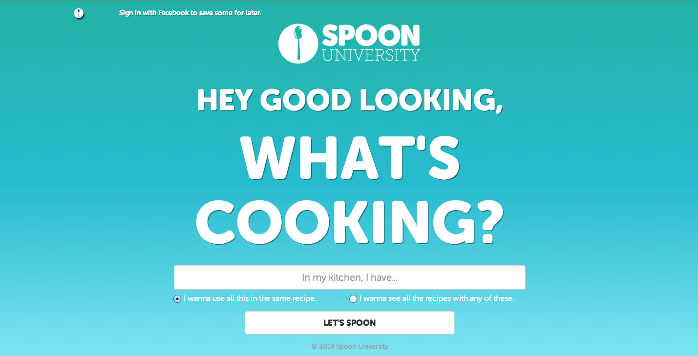
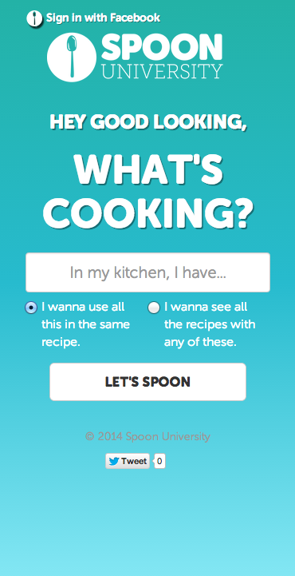
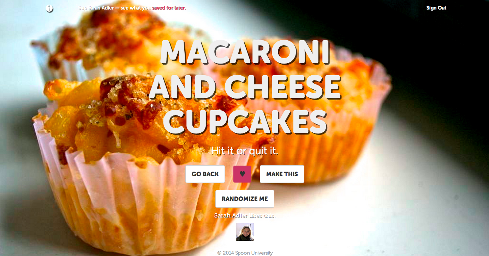
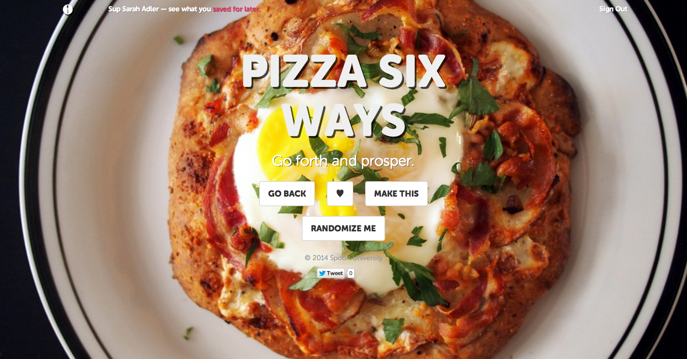
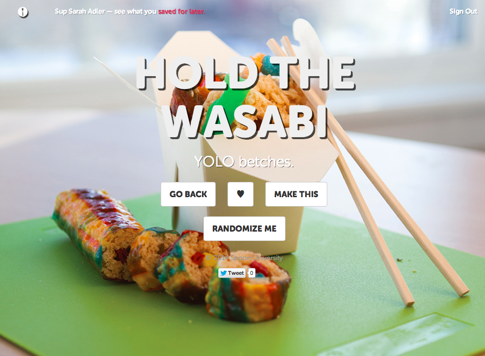
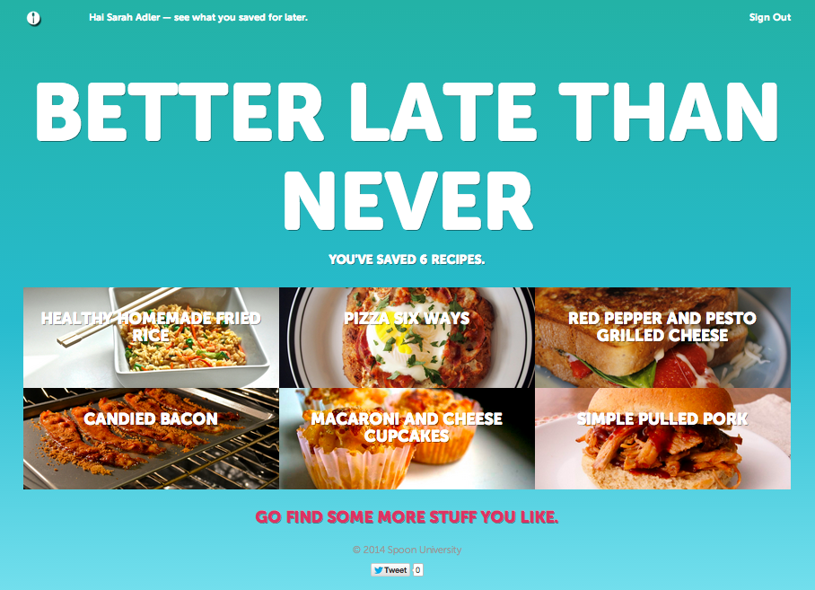

# Let's Spoon

Let's Spoon lets you pick recipes by ingredients — you can select multiple things you want to pair together, or ingredients you'd use separately for a wider search. It pulls from <http://spoonuniversity.com> and makes it fun, easy and pretty to search through the all we offer. Plus, you can use the Randomizer to scroll through beautiful, full-screen photos endlessly… because everyone loves food porn.

### What's cooking, good looking?

Let's Spoon integrates Facebook signin to allow users to save recipes for later, storing them away on a special page that holds all the recipes that user has liked. Plus, there's the fun social aspect of listing all the people who have liked popular recipes.

The app was designed to gamify the experience of searching for recipes, making the process quick, visually appealling and social across all devices.

The most challenging aspects of the back end were parsing the database and selecting the ingredients lists out of the post content, to allow the user to search only the ingredients list and not words outside of it that may confuse the results (e.g. a post about grilled cheese where the intro says, 'Wouldn't this go great with tomato soup?'). Then, allowing the user to search by both 'and' and 'or' was also challenging.

